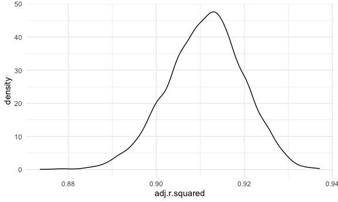
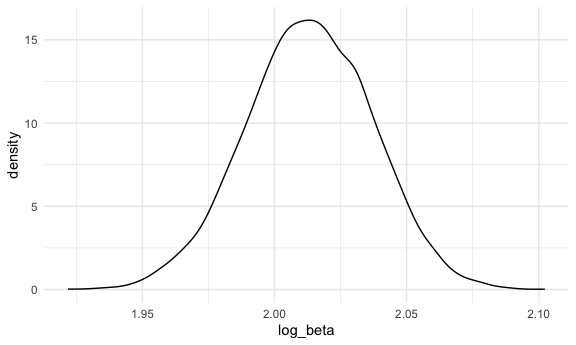
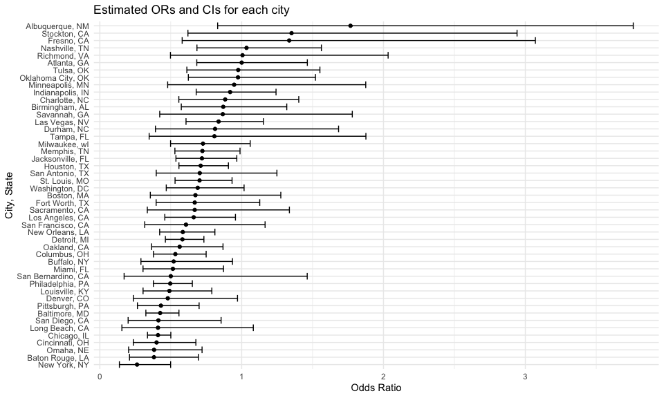
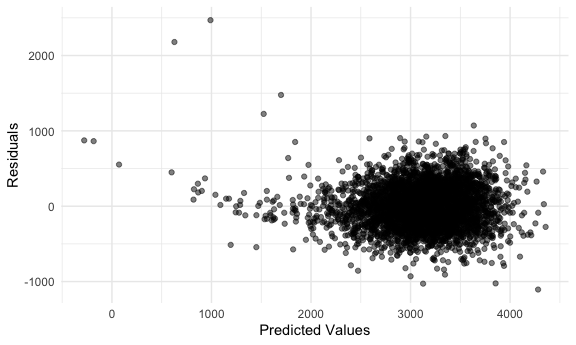
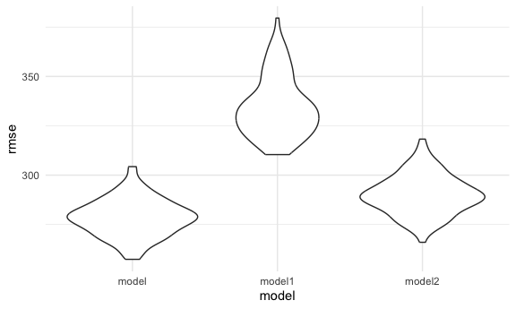

p8105_hw06_hc3448
================
HsiYu Chen
2024-11-28

## Problem 1

``` r
weather_df = 
  rnoaa::meteo_pull_monitors(
    c("USW00094728"),
    var = c("PRCP", "TMIN", "TMAX"), 
    date_min = "2017-01-01",
    date_max = "2017-12-31") %>%
  mutate(
    name = recode(id, USW00094728 = "CentralPark_NY"),
    tmin = tmin / 10,
    tmax = tmax / 10) %>%
  select(name, id, everything())
```

``` r
bootstrap_df = 
  weather_df |> 
  modelr::bootstrap(5000) |> 
  mutate(
    models = map(strap, \(x) lm(tmax ~ tmin, data = x)),
    glance_result = map(models, broom::glance),
    tidy_result = map(models, broom::tidy)
  ) |> 
  unnest(tidy_result) |>
  select(term, estimate, glance_result) |>
  pivot_wider(
    names_from = term,
    values_from = estimate
  ) |>
  mutate(log_beta = log(`(Intercept)`*tmin)) |>
  unnest(glance_result) |>
  select(log_beta, adj.r.squared)

bootstrap_df |> head(5) |> knitr::kable()
```

| log_beta | adj.r.squared |
|---------:|--------------:|
| 2.043075 |     0.9063532 |
| 2.029909 |     0.8955962 |
| 2.051741 |     0.9176265 |
| 2.065853 |     0.8984552 |
| 1.973252 |     0.9132086 |

``` r
ggplot(bootstrap_df, aes(x = adj.r.squared)) +
      geom_density()
```



The distribution of the estimates for r squared seems like a normal
distribution with mean between 0.91 and 0.92, and range between 0.88 and
0.94.

``` r
ggplot(bootstrap_df, aes(x = log_beta)) +
      geom_density()
```



The distribution of the estimates for log(B0\*B1) seems like a normal
distribution with mean between 2.00 and 2.05, and range between 1.925
and 2.10.

``` r
bootstrap_df |> 
  summarize(
    r_squared_25 = quantile(adj.r.squared, probs = 0.025),
    r_squared_975 = quantile(adj.r.squared, probs = 0.975),
    log_beta_25 = quantile(log_beta, probs = 0.025),
    log_beta_975 = quantile(log_beta, probs = 0.975),
  ) |> knitr::kable(digit = 3)
```

| r_squared_25 | r_squared_975 | log_beta_25 | log_beta_975 |
|-------------:|--------------:|------------:|-------------:|
|        0.893 |         0.927 |       1.965 |        2.059 |

## Problem 2

``` r
homicide_df = 
  read_csv("data/homicide-data.csv") |> 
  mutate(
    city_state = paste(city, state, sep = ", "),
    solved = ifelse(disposition == "Closed by arrest", 1, 0),
    victim_age = as.numeric(victim_age)
  ) |> 
  filter(
    !(city_state %in% c("Dallas, TX", "Phoenix, AZ", "Kansas City, MO", "Tulsa, AL")),
    victim_race %in% c("White", "Black")
  ) 
```

``` r
baltimore_glm = 
  homicide_df |>
  filter(city_state == "Baltimore, MD")|>
  glm(solved ~ victim_age + victim_sex + victim_race, 
      data = _,
      family = binomial())

baltimore_results = 
  baltimore_glm |>
  broom::tidy() |>
  filter(term == "victim_sexMale") |>
  mutate(
    OR = exp(estimate),
    CI_upper = exp(estimate + 1.96 * std.error),
    CI_lower = exp(estimate - 1.96 * std.error)
  ) 

baltimore_results |> knitr::kable(digit = 3)
```

| term           | estimate | std.error | statistic | p.value |    OR | CI_upper | CI_lower |
|:---------------|---------:|----------:|----------:|--------:|------:|---------:|---------:|
| victim_sexMale |   -0.854 |     0.138 |    -6.184 |       0 | 0.426 |    0.558 |    0.325 |

``` r
homicide_glm = 
  homicide_df |>
  nest(data = -city_state) |> 
  mutate(
    models = purrr::map(data, \(x) glm(solved ~ victim_age + victim_sex + victim_race, data = x, family = binomial())),
    results = purrr::map(models, broom::tidy)
    )|>
  select(-data, -models) |> 
  unnest(results)
  

homicide_results = 
  homicide_glm |>
  filter(term == "victim_sexMale") |>
  mutate(
    OR = exp(estimate),
    CI_upper = exp(estimate + 1.96 * std.error),
    CI_lower = exp(estimate - 1.96 * std.error)
  ) |>
  select(city_state, OR, CI_upper, CI_lower)

homicide_results |> knitr::kable(digit = 3)
```

| city_state         |    OR | CI_upper | CI_lower |
|:-------------------|------:|---------:|---------:|
| Albuquerque, NM    | 1.767 |    3.761 |    0.831 |
| Atlanta, GA        | 1.000 |    1.463 |    0.684 |
| Baltimore, MD      | 0.426 |    0.558 |    0.325 |
| Baton Rouge, LA    | 0.381 |    0.695 |    0.209 |
| Birmingham, AL     | 0.870 |    1.318 |    0.574 |
| Boston, MA         | 0.674 |    1.276 |    0.356 |
| Buffalo, NY        | 0.521 |    0.935 |    0.290 |
| Charlotte, NC      | 0.884 |    1.403 |    0.557 |
| Chicago, IL        | 0.410 |    0.501 |    0.336 |
| Cincinnati, OH     | 0.400 |    0.677 |    0.236 |
| Columbus, OH       | 0.532 |    0.750 |    0.378 |
| Denver, CO         | 0.479 |    0.971 |    0.236 |
| Detroit, MI        | 0.582 |    0.734 |    0.462 |
| Durham, NC         | 0.812 |    1.683 |    0.392 |
| Fort Worth, TX     | 0.669 |    1.127 |    0.397 |
| Fresno, CA         | 1.335 |    3.071 |    0.580 |
| Houston, TX        | 0.711 |    0.907 |    0.558 |
| Indianapolis, IN   | 0.919 |    1.242 |    0.679 |
| Jacksonville, FL   | 0.720 |    0.966 |    0.537 |
| Las Vegas, NV      | 0.837 |    1.154 |    0.608 |
| Long Beach, CA     | 0.410 |    1.082 |    0.156 |
| Los Angeles, CA    | 0.662 |    0.956 |    0.458 |
| Louisville, KY     | 0.491 |    0.790 |    0.305 |
| Memphis, TN        | 0.723 |    0.988 |    0.529 |
| Miami, FL          | 0.515 |    0.872 |    0.304 |
| Milwaukee, wI      | 0.727 |    1.060 |    0.499 |
| Minneapolis, MN    | 0.947 |    1.875 |    0.478 |
| Nashville, TN      | 1.034 |    1.562 |    0.685 |
| New Orleans, LA    | 0.585 |    0.811 |    0.422 |
| New York, NY       | 0.262 |    0.499 |    0.138 |
| Oakland, CA        | 0.563 |    0.868 |    0.365 |
| Oklahoma City, OK  | 0.974 |    1.520 |    0.624 |
| Omaha, NE          | 0.382 |    0.721 |    0.203 |
| Philadelphia, PA   | 0.496 |    0.652 |    0.378 |
| Pittsburgh, PA     | 0.431 |    0.700 |    0.265 |
| Richmond, VA       | 1.006 |    2.033 |    0.498 |
| San Antonio, TX    | 0.705 |    1.249 |    0.398 |
| Sacramento, CA     | 0.669 |    1.337 |    0.335 |
| Savannah, GA       | 0.867 |    1.780 |    0.422 |
| San Bernardino, CA | 0.500 |    1.462 |    0.171 |
| San Diego, CA      | 0.413 |    0.855 |    0.200 |
| San Francisco, CA  | 0.608 |    1.165 |    0.317 |
| St. Louis, MO      | 0.703 |    0.932 |    0.530 |
| Stockton, CA       | 1.352 |    2.942 |    0.621 |
| Tampa, FL          | 0.808 |    1.876 |    0.348 |
| Tulsa, OK          | 0.976 |    1.552 |    0.614 |
| Washington, DC     | 0.690 |    1.017 |    0.468 |

``` r
homicide_results |>
  ggplot(aes(x = OR , y = reorder(city_state, OR))) +
  geom_point() +
  geom_errorbar((aes(xmin = CI_lower, xmax = CI_upper))) +
  labs(
    title = "Estimated ORs and CIs for each city",
    x = "Odds Ratio",
    y = "City, State"
  )
```



From the plot, we can see that except for Albuquerque, Stockton, Fresno,
Nashville, Richmond, and Atlanta, other cities have odds ratio below 1.
It suggests that in these cities, males compared to females are less
likely to have their homicides solved. However, the error bars for the
cities with higher odds ratio (Albuquerque, Stockton, Fresno) are large,
and it indicates the uncertainty of the true adjusted odds ratio.

## Problem 3

``` r
bw_df = 
  read_csv("data/birthweight.csv") |>
  janitor::clean_names() |>
  mutate(
    babysex =as.factor( case_match(babysex, 1~ "male", 2~ "female")),
    frace = as.factor(case_match(frace,
                1 ~ "white", 
                2 ~ "black", 
                3 ~ "asian",
                4 ~ "puerto rican", 
                8 ~ "other",
                9 ~ "unknown")),
     mrace = as.factor(case_match(mrace,
            1 ~ "white", 
            2 ~ "black", 
            3 ~ "asian",
            4 ~ "puerto rican", 
            8 ~ "other")),
    malform = as.factor(case_match(malform,
                 0 ~ "absent",
                 1 ~ "present"))
  )
```

Number of missing data: `sum(is.na(bw_df))`.

My proposed regression model for birthweight: I created the model using
the main effects of factors that I hypothesized to be highly correlated
with the outcome: gaweeks, bhead, blength, mrace, and wtgain.

``` r
bw_model = lm(bwt ~ gaweeks + bhead + blength + mrace + wtgain, data = bw_df)
summary(bw_model)
```

    ## 
    ## Call:
    ## lm(formula = bwt ~ gaweeks + bhead + blength + mrace + wtgain, 
    ##     data = bw_df)
    ## 
    ## Residuals:
    ##     Min      1Q  Median      3Q     Max 
    ## -1106.0  -187.4    -3.6   182.8  2469.1 
    ## 
    ## Coefficients:
    ##                     Estimate Std. Error t value Pr(>|t|)    
    ## (Intercept)       -5807.5797   106.4789 -54.542  < 2e-16 ***
    ## gaweeks              11.3687     1.4762   7.701 1.66e-14 ***
    ## bhead               133.1043     3.4506  38.574  < 2e-16 ***
    ## blength              78.0231     2.0342  38.356  < 2e-16 ***
    ## mraceblack          -29.8084    42.8414  -0.696   0.4866    
    ## mracepuerto rican   -22.2609    45.9254  -0.485   0.6279    
    ## mracewhite           94.6328    42.7419   2.214   0.0269 *  
    ## wtgain                3.6476     0.3949   9.236  < 2e-16 ***
    ## ---
    ## Signif. codes:  0 '***' 0.001 '**' 0.01 '*' 0.05 '.' 0.1 ' ' 1
    ## 
    ## Residual standard error: 277.5 on 4334 degrees of freedom
    ## Multiple R-squared:  0.7069, Adjusted R-squared:  0.7064 
    ## F-statistic:  1493 on 7 and 4334 DF,  p-value: < 2.2e-16

``` r
plot_model = 
  bw_df |>
  modelr::add_predictions(bw_model) |>
  modelr::add_residuals(bw_model) |>
  ggplot(aes(x = pred, y = resid)) +
  geom_point(alpha = 0.5) +
  labs(
    x = "Predicted Values",
    y = "Residuals"
  )

plot_model
```



The other two models for comparisons:

``` r
bw_model_1 = lm(bwt ~ blength + gaweeks, data = bw_df)
bw_model_2 = lm(bwt ~ bhead + blength + babysex + bhead*blength + bhead*babysex + blength*babysex + bhead*blength*babysex , data = bw_df)
```

``` r
cv_df = 
  crossv_mc(bw_df, 100) |>
  mutate(
    train = map(train, as_tibble),
    test = map(test, as_tibble)
  )

cv_result_df = 
  cv_df |> 
  mutate(
    model = map(train, \(x) lm(bwt ~ gaweeks + bhead + blength + mrace + wtgain, data = x)),
    model1 = map(train, \(x) lm(bwt ~ blength + gaweeks, data = x)),
    model2 = map(train, \(x) lm(bwt ~ bhead + blength + babysex + bhead*blength + bhead*babysex + blength*babysex + bhead*blength*babysex, data = x))
  ) |> 
  mutate(
    rmse_model = map2_dbl(model, test, rmse),
    rmse_model1 = map2_dbl(model1, test, rmse),
    rmse_model2 = map2_dbl(model2, test, rmse)
  )
```

``` r
plot_cv_result = 
  cv_result_df |>
  select(starts_with("rmse")) |>
  pivot_longer(
    everything(),
    names_to = "model", 
    values_to = "rmse",
    names_prefix = "rmse_",
  ) |>
  ggplot(aes(x = model, y = rmse)) + 
  geom_violin()

plot_cv_result
```



The model (my proposed model) has the lowest rmse, indicating better
predictive accuracy compared to model 1 and model 2.
